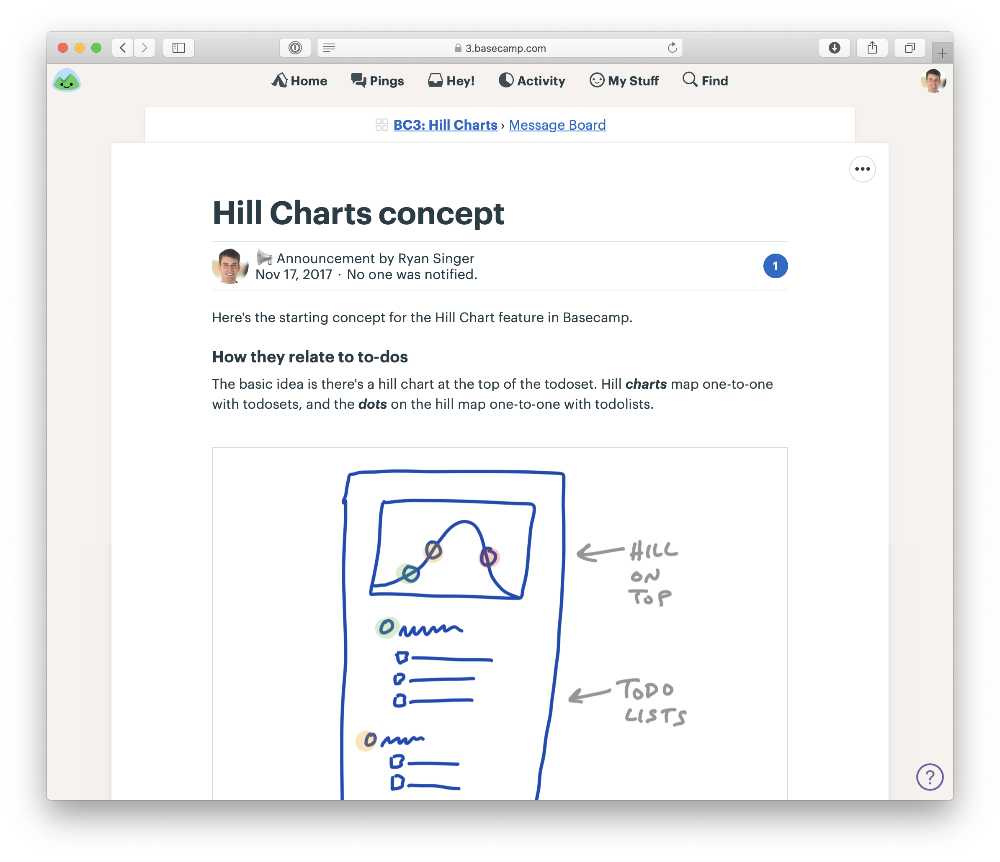
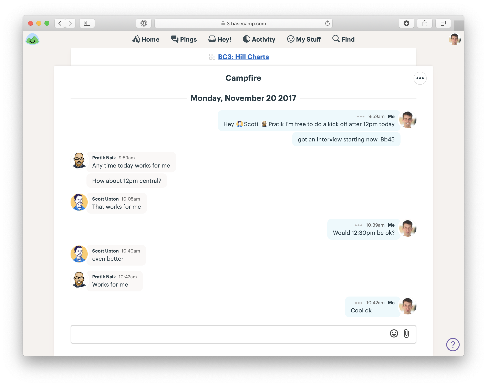

# Hand Over Responsibility

We’ve made our bets and now it’s time to start the next cycle. How does the team get started?

## Assign projects, not tasks

We *don’t* start by assigning tasks to anyone. Nobody plays the role of the “taskmaster” or the “architect” who splits the project up into pieces for other people to execute.

Splitting the project into tasks up front is like putting the pitch through a paper shredder. Everybody just gets disconnected pieces. We want the project to stay “whole” through the entire process so we never lose sight of the bigger picture.

Instead, we trust the team to take on the entire project and work within the boundaries of the pitch. The team is going to define their own tasks and their own approach to the work. They will have full autonomy and use their judgement to execute the pitch as best as they can.

Teams love being given more freedom to implement an idea the way they think is best. Talented people don’t like being treated like “code monkeys” or ticket takers.

Projects also turn out better when the team is given responsibility to look after the whole. Nobody can predict at the beginning of a project what exactly will need to be done for all the pieces to come together properly. What works on paper almost never works exactly as designed in practice. The designers and programmers doing the real work are in the best position to make changes and adjustments or spot missing pieces.

When teams are assigned individual tasks, each person can execute their little piece without feeling responsible for judging how all the pieces fit together. Planning up front makes you blind to the reality along the way.

Remember: we aren’t giving the teams absolute freedom to invent a solution from scratch. We’ve done the shaping. We’ve set the boundaries. Now we are going to trust the team to fill in the outline from the pitch with real design decisions and implementation.

This is where our efforts to define the project at the right level of abstraction—without too much detail—will pay off. With their talent and knowledge of the particulars, the team is going to arrive at a better finished product than we could have by trying to determine the final form in advance.

## Done means deployed

At the end of the cycle, the team will deploy their work. In the case of a Small Batch team with a few small projects for the cycle, they’ll deploy each one as they see fit as long as it happens before the end of the cycle.

This constraint keeps us true to our bets and respects the `circuit breaker`. The project needs to be done within the time we budgeted; otherwise, our appetite and budget don’t mean anything.

That also means any testing and QA needs to happen *within* the cycle. The team will accommodate that by scoping off the most essential aspects of the project, finishing them early, and coordinating with QA. (More on that later.)

For most projects we aren’t strict about the timing of help documentation, marketing updates, or announcements to customers and don’t expect those to happen within the cycle. Those are thin-tailed from a risk perspective (they never take 5x as long as we think they will) and are mostly handled by other teams. We’ll often take care of those updates and publish an announcement about the new feature during cool-down after the cycle.

## Kick-off

We start the project by creating a new [Basecamp](https://basecamp.com/) project and adding the team to it. Then the first thing we’ll do is post the shaped concept to the Message Board. We’ll either post the original pitch or a distilled version of it.

The first thing on the [Basecamp](https://basecamp.com/) project is a message with the shaped concept

Since our teams are remote, we use the chat room in the Basecamp project to arrange a kick-off call.

Arranging a call with the team to walk through the shaped work

The call gives the team a chance to ask any important questions that aren’t clear from the write-up. Then, with a rough understanding of the project, they’re ready to get started.

## Getting oriented

Work in the first few days doesn’t look like “work.” No one is checking off tasks. Nothing is getting deployed. There aren’t any deliverables to look at. Often there isn’t even much communication between the team in the first few days. There can be an odd kind of radio silence.

Why? Because each person has their head down trying to figure out how the existing system works and which starting point is best. Everyone is busy learning the lay of the land and getting oriented.

The team figuring out where to start

It’s important for managers to respect this phase. Teams can’t just dive into a code base and start building new functionality immediately. They have to acquaint themselves with the relevant code, think through the pitch, and go down some short dead ends to find a starting point. Interfering or asking them for status too early hurts the project. It takes away time that the team needs to find the best approach. The exploration needs to happen anyway. Asking for visible progress will only push it underground. It’s better to empower the team to explictly say “I’m still figuring out how to start” so they don’t have to hide or disguise this legitimate work.

Generally speaking, if the silence doesn’t start to break after three days, that’s a reasonable time to step in and see what’s going on.

## Imagined vs discovered tasks

Since the team was given the project and not tasks, they need to come up with the tasks themselves. Here we note an important difference between tasks we *think* we need to do at the start of a project and the tasks we *discover* we need to do in the course of doing real work.

The team naturally starts off with some imagined tasks—the ones they assume they’re going to have to do just by thinking about the problem. Then, as they get their hands dirty, they discover all kinds of other things that we didn’t know in advance. These unexpected details make up the true bulk of the project and sometimes present the hardest challenges.

Teams discover tasks by doing real work. For example, the designer adds a new button on the desktop interface but then notices there’s no obvious place for it on the mobile webview version. They record a new task: figure out how to reveal the button on mobile. Or the first pass of the design has good visual hierarchy, but then the designer realizes there needs to be more explanatory copy in a place that disrupts the layout. Two new tasks: Change the layout to accommodate explanatory copy; write the explanatory copy.

Often a task will appear in the process of doing something unrelated. Suppose a programmer is working on a database migration. While looking at the model to understand the associations, she might run into a method that needs to be updated for a different part of the project later. She’s going to want to note a task to update that method later.

**The way to really figure out what needs to be done is to start doing real work.** That doesn’t mean the teams start by building just anything. They need to pick something meaningful to build first. Something that is central to the project while still small enough to be done end-to-end—with working UI and working code—in a few days.

In the next chapters we’ll look at how the team chooses that target and works together to get a fully integrated spike working.
