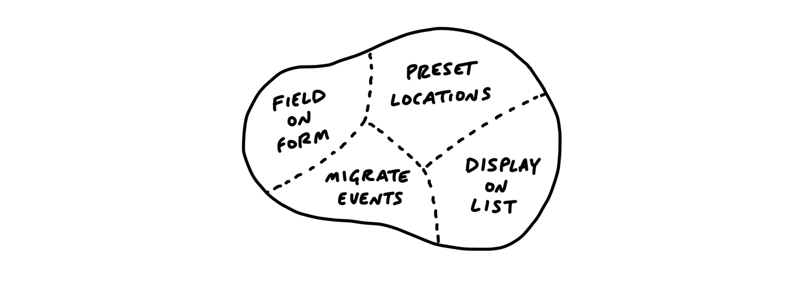

# Map the Scopes

In the previous chapter, we started the project by finishing one integrated slice early on. That practice belongs to a more general technique that the team can use throughout the project.

## Organize by structure, not by person

When asked to organize tasks for a project, people often separate work by person or role: they’ll create a list for Designers and a list for Programmers. This leads to the problem we talked about in the previous chapter—people will complete tasks, but the tasks won’t add up to a finished part of the project early enough.

To take an example outside of software, consider someone organizing a fundraising event. They could create a list of tasks for each of their three volunteers and track the work that way. But then there’d be no way to see the big picture of how the event is coming together—what’s done and what’s not done at the macro level. Instead, they should create lists based on the *structure* of the project—the things that can be worked on and finished independently of each other. To do that, they would create lists for Food Menu, Venue Setup, and Light/Sound. Then the organizer can easily see which areas are done and which areas have outstanding work.

In product development, the categories aren’t pre-cut for us. We usually build things we’ve never built before. Each project is a wild territory that we have to walk through before we can draw a map. By digging into the work, we figure out where the interdependencies are, how things are connected, and what we can slice apart.

As we saw in the previous chapter, the slices of work integrate front-end and back-end tasks. This allows us to finish one slice of the actual project and definitively move on. That’s better than having lots of pieces that—fingers crossed—are supposed to come together by the end of the cycle.

We call these integrated slices of the project `scopes`. We break the overall scope (singular) of the project into separate scopes (plural) that can be finished independently of each other. In this chapter, we’ll see how the team maps the project into scopes and tackles them one by one.

## The scope map

Imagine an overhead view of the project. At the beginning, there’s just an outline from the shaping work that preceded the project. There aren’t any tasks or scopes yet.

When the team members take over the project, they start discovering tasks. Tasks are a natural starting point because they’re concrete and granular. It’s too early to organize them into higher level categories. It would be artificial to try and group them arbitrarily. It’s enough at the start just to capture a variety of things that need to happen.

But we don’t want to stay with this picture for long. It’s too low-level. There’s nothing visible from high altitude.

As the team starts doing real work on the project they learn how the tasks are related and what the structure of the project is really like. Then they become able to factor the project into scopes. This is like dividing the map of the project into separate territories.

The scopes reflect the meaningful parts of the problem that can be completed independently and in a short period of time—a few days or less. They are bigger than tasks but much smaller than the overall project.

The map is a mental image. In practice, we define and track the scopes as to-do lists. Each scope corresponds to a list name. Then any tasks for that scope go in that list.

## The language of the project

Scopes are more than just slices. They become the language of the project at the macro level. When we were building the *Clients in Projects* feature, the team used the language of the scopes like this: “After *Bucket Access* is done we can implement *Invite Clients*. Then we’ll *Update Recording Visibility* when people on the firm flip the *Visibility Toggle*.”

When it’s time to report status, the team uses the language of scopes to explain what’s done and what’s not done. It’s more satisfying to have the conversation at a high level and point to finished pieces of software, instead of going down into the weeds and defending the purposes and status of individual outstanding tasks. (We’ll see more in the next chapter about how to report on scopes using the Hill Chart.)

## Case study: Message drafts

A designer and programmer were building a feature to create and save drafts of messages in a new app. After kick-off, they identified a bunch of tasks they would need to do at some point.

As the end of the first week approached, they had completed some of the tasks, but there wasn’t anything to show for their work. In the spirit of “get one piece done” they focused on one key interaction they could integrate: creating a new draft.

They called the new scope “Start New,” created a to-do list for it, and moved to-dos into it. There was only one design task left for them to consider this scope finished.

After finishing the one design task, the scope was complete.

The unscoped tasks that are left don’t represent all the work that remains. More tasks are going to be discovered as they start working on each of those. Still, there is enough variety in the work to tease out more scopes. The team was motivated to break out the scopes already at this point because they knew they wanted their efforts to add up to another visible piece being finished before long.

Taking a look at the tasks that were left, they decided to pull out tasks related to finding the drafts into a new scope called Locate and the task for deleting into a scope called Trash. The work that was left all seemed related to saving and editing the draft, so they called that Save/Edit.

Take a look at the Locate scope. There’s only one task there right now. But surely there will be more work to do than just designing the index. When there are implementation tasks to do, that’s where they’ll go.

The designer started some work on Locate while the programmer focused on Save/Edit. As she dug into it, she noticed she could carve off a couple pieces to make more visible progress. There were really three scopes in it.

First she factored out the work related to sending the drafted message. She called that Send.

Finally, some of the remaining Save/Edit tasks were about storing information and one other was actually unrelated—it was a special case for handling drafts when replying to another message. She broke these out into two new scopes: Store and Reply.

At this point the team suddenly felt like they could see the whole of the project at a high level. All the major parts were visible at the macro level as scopes. None of them were so big that important or challenging tasks could hide inside of them unnoticed.

Meanwhile, the designer had made progress on Locate. After a little wiring, they were able to mark that done. Tasks were getting done on Send and Store as well.

Once Send and Store were finished, just a couple tasks remained for Trash and Reply.

And then the project was done.

## Discovering scopes

Scope mapping isn’t planning. You need to walk the territory before you can draw the map. Scopes properly drawn are not arbitrary groupings or categories for the sake of tidiness. They reflect the real ground truth of what can be done independently—the underlying interdependencies and relationships in the problem.

Scopes arise from interdependencies. The way parts depend on each other determines when you can say a given piece of the work is “done.” You don’t know what the work and interdependencies actually are in advance. We talked earlier about imagined versus discovered tasks. The same principle applies to scopes. The scopes need to be discovered by doing the real work and seeing how things connect and don’t connect.

That’s why at the start of a project, we don’t expect to see accurate scopes. We’re more likely to see them at the end of week one or start of week two, after the team has had a chance to do some real work and find the natural dividing lines in the anatomy of the problem.

It’s also normal to see some shuffling and instability in the scopes at first. The lines get redrawn or scopes renamed as the team feels out where the boundaries really are, like in the example above. The team was focused on specific problems of saving and editing drafts, so it was easiest to identify that scope early. It wasn’t until they got into the weeds that they noticed there were tasks specifically about sending the draft and made that a separate scope.

## How to know if the scopes are right

Well-made scopes show the anatomy of the project. When you feel a pain in your body, you don’t have to question whether it’s in your arms or your legs or your head. You know the parts and their names so you can explain where the pain is. In the same way, every project has a natural anatomy that arises from the design you want, the system you’re working within, and the interdependencies of the problems you have to solve.

Three signs indicate when the scopes are right:

1. You feel like you can see the whole project and nothing important that worries you is hidden down in the details.
2. Conversations about the project become more flowing because the scopes give you the right language.
3. When new tasks come up, you know where to put them. The scopes act like buckets that you can easily lob new tasks into.

On the other hand, these three signs indicate the scopes should be redrawn:

1. It’s hard to say how “done” a scope is. This often happens when the tasks inside the scope are unrelated. If the problems inside the scope are unrelated, finishing one doesn’t get you closer to finishing the other. It’s good in this case to look for something you can factor out, like in the Drafts example.
2. The name isn’t unique to the project, like “front-end” or “bugs.” We call these “grab bags” and “junk drawers.” This suggests you aren’t integrating enough, so you’ll never get to mark a scope “done” independent of the rest. For example, with bugs, it’s better to file them under a specific scope so you can know whether, for example, “Send” is done or if you need to fix a couple bugs first before putting it out of mind.
3. It’s too big to finish soon. If a scope gets too big, with too many tasks, it becomes like its own project with all the faults of a long master to-do list. Better to break it up into pieces that can be solved in less time, so there are victories along the way and boundaries between the problems to solve.

Let’s close this chapter with a few tips for dealing with different kinds of tasks and scopes that will come up.

## Layer cakes

Most software projects require some UI design and a thin layer of code below. Think of a database app where all you need to do is enter information, save it, and display it back. Work like this looks like a `layer cake`: You can judge the work by UI surface area because the back-end work is thin and evenly distributed. In these cases, you can integrate all design and programmer tasks together in the same scope. This is a good default for most “information system” type apps.

## Icebergs

But sometimes there is significantly more back-end work than UI work or vice versa. For example, a new feature that only requires submitting a form could require very complex business logic to return the right answer. This kind of work is like an iceberg.

For icebergs, it can help to factor out the UI as a separate scope of work (assuming the UI isn’t interdependent with the back-end complexity). If the back-end is complex enough, you can split it into separate concerns and then turn those into scopes as well. The goal in cases like this is to define some different things you can finish and integrate in stages, rather than waiting until the 11th hour with fingers crossed that it will all come together.

You also sometimes see upside-down icebergs, where there is a ton of UI complexity with less back-end complexity. For example, the data model for a calendar isn’t complicated, but the interaction for rendering a multiple-day event and wrapping across grid cells could take a lot of time and problem-solving.

For both back-end and front-end icebergs, we always question them before accepting them as a fact. Is the complexity really necessary and irreducible? Do we need that fancy UI? Is there a different way to build that back-end process so it has fewer interdependencies with the rest of the system?

## Chowder

There are almost always a couple things that don’t fit into a scope. We allow ourselves a “Chowder” list for loose tasks that don’t fit anywhere. But we always keep a skeptical eye on it. If it gets longer than three to five items, something is fishy and there’s probably a scope to be drawn somewhere.

## Mark nice-to-haves with ~

New tasks constantly come up as you get deeper into a problem. You’ll find code that could be cleaned up, edge cases to address, and improvements to existing functionality. A good way to deal with all those improvements is to record them as tasks on the scope but mark them with a ~ in front. This allows everyone on the team to constantly sort out the `must-haves` from the `nice-to-haves`.

In a world with no deadlines, we could improve everything forever. But in a fixed time box, we need a machete in our hands to cut down the constantly growing scope. The ~ at the start of an item, or even a whole scope, is our best tool for that. We’ll come back to this technique when we talk about making cuts to scope in Chapter 14, [Decide When to Stop](https://basecamp.com/shapeup/3.5-chapter-14).
