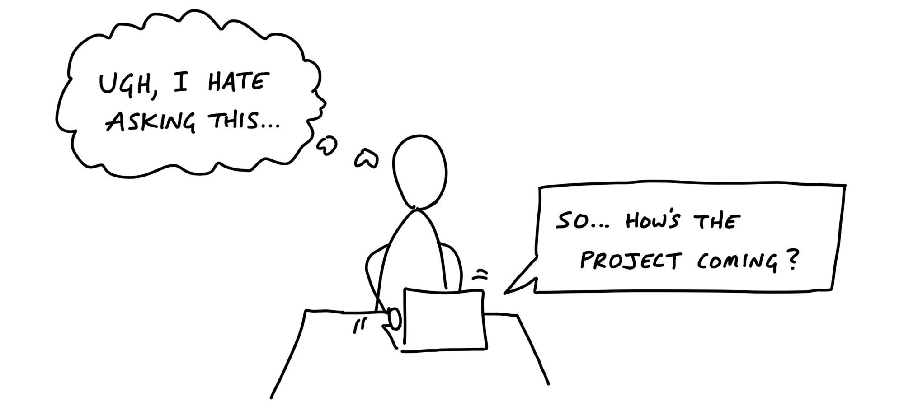
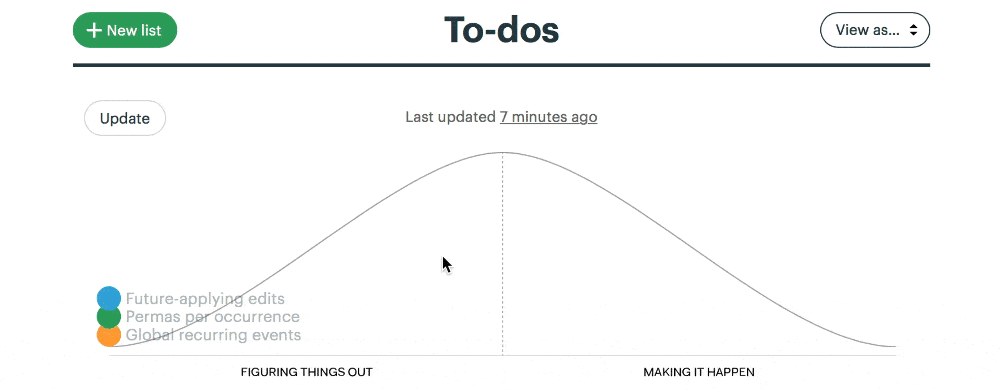

# Show Progress

Good-hearted managers don’t like asking for status. It’s awkward, feels like nagging, and gets even worse when they have to ask follow-up questions to get sufficiently clear about what’s going on.

Managers would rather be able to see the status themselves whenever they need to. We saw in the last chapter how organizing to-dos into scopes helps the team to stay on top of the work. But this doesn’t help the manager directly. There are a couple problems with to-dos that make them insufficient for judging status.

## The tasks that aren’t there

Consider a list with a few completed items and no incomplete items left. This could mean that all the work is done. But it could also mean that the team knows there’s more work but hasn’t defined tasks yet.

Sometimes a team will define a `scope` early in the project without populating it with tasks. It marks that some work needs to be done but that actual tasks haven’t been discovered yet.

Or think about doing some QA at the end of a scope. All the tasks are done. There’s nothing else to do. Then the act of testing populates the scope with new tasks for the issues found.

This goes back to the notion of `imagined` versus `discovered` tasks. In our naive notion of a list that’s planned up-front, somebody populates it with items that are gradually checked off. In real life, issues are discovered by getting involved in the problem. That means *to-do lists actually grow as the team makes progress*.

![Two diagrams with the same axes. The top is labeled: In Theory. The Y axis is tasks and the X axis is time. A to-do list is shown at five time steps t1 through t5. The list is the same length in every time step. At t1 none of the items are completed. They are gradually completed in each step until at t5 all the items are checked. Below, the second digram is labeled: In Practice. At t1 the list is five items long. At t2, it is still five items long and three of the items are completed. At t3, the list gets taller with new uncompleted items. At t4, two items get completed, but it still gets taller due to an extra item added. At t5 all items are completed. t3 and t4 are labeld: More tasks discovered. The height of the list has grown from t1 to t5, in contrast with the constant height in the first diagram.](../assets/tasks_growing-9ec9f929e6eb6dab7ba05e7c02a5b4c33ba5739622236c2f213ebe75bcb4c17c.jpg)

If we tried to judge at *t2* how far along the project is, we’d be misled. From an outsider’s perspective, there’s no way to know whether the number of outstanding tasks will go down or up. To know that, you’d need more context on the work inside the scope to understand what it means that those particular tasks are done and whether others might still be coming.

## Estimates don’t show uncertainty

Some teams try to attach estimates to their tasks or scopes to report status. The problem with estimates is they have a very different meaning depending on the nature of the work being estimated.

Say you have two tasks, both estimated to take four hours. If one task is something the team has done ten times in the past, you can be confident in the estimate. Suppose the other task is something the team has never done before, or it has unclear interdependencies. It could take the four hours if all goes perfectly, but due to the unknowns in it, it could stretch out to two to three days. It’s not meaningful to write “4 hours, or maybe 3 days” as the estimate.

Recognizing this, we came up with a way to see the status of the project without counting tasks and without numerical estimates. We do that by shifting the focus from what’s done or not done to what’s unknown and what’s solved. To enable this shift, we use the metaphor of the hill.

## Work is like a hill

Every piece of work has two phases. First there’s the uphill phase of figuring out what our approach is and what we’re going to do. Then, once we can see all the work involved, there’s the downhill phase of execution.

![A Hill Chart diagram. It looks like a wide bell curve, with a vertical dotted line down the middle. The far left edge is labeled: Start, and the far right edge labeled: Finish. The left slope going up is labeled: Figuring out what to do. The right slope going down is labeld: Getting it done. A dot is drawn about two-thirds of the way up the left side of the hill. Light-colored arrows suggest the dot originated at the left side, moved up to its current position, and later moves over the hill and down the right to the finish.](../assets/hill_concept-a0a77c0ebb209b61899b8b4cdb1a315f2807e3fdc2e1d2373e2f19060725f042.png)

Let’s use an everyday example to get the feeling of the hill.

Suppose you’re planning to host a dinner party. You’ve set the date, but it’s still a couple weeks ahead and you haven’t thought about what to cook yet. You have no idea what type of cuisine the meal will be or what dish to make. That would place you at the start of the hill on the bottom-left.

Next you think about who’s attending and note that a couple people are vegetarian. That eliminates some options (like grilling out) but still leaves a lot of options open. You consider both Italian and Indian. You think Indian might be more fun to cook, with more interesting vegetarian options. So you decide to look for Indian recipes.

At this point, the question “What percent complete is the project?” doesn’t even make sense. And if someone asked you to estimate how long the shopping and prep will take, you couldn’t answer that either because you haven’t chosen a dish yet. The answer would be: “I’ve done some work to figure out what kind of cuisine, but I haven’t narrowed it down to a specific dish yet.” We can represent that by putting you halfway up the “figuring it out” side of the hill.

Next you do some searching online and look through your recipe books. You want to find a recipe that will be interesting but doesn’t require ingredients that will be too hard to find. You settle on a recipe and prepare a shopping list.

Now you are in a very different position than before. The feeling changes from “I’m still not sure what I’m doing” to “Now I know what to do.” You’re at the top of the hill.

From this vantage point, you can see all of the steps that are left. It’s even fair to estimate how long all the work will take (“Let’s see…an hour to grocery shop, 30 minutes of prep, cook for 45 minutes…”).

The day before the dinner party, you go to the grocery store and buy the ingredients. This moves you downhill. You’re closer to finishing the task.

Next comes the work of prepping and cooking the meal.

After the meal is over, there’s just a little work left: the clean-up.

Note how the hill shows how the work *feels* at different stages. The uphill phase is full of uncertainty, unknowns, and problem solving. The downhill phase is marked by certainty, confidence, seeing everything, and knowing what to do.

## Scopes on the hill

We can combine the hill with the concept of scopes from the last chapter. The scopes give us the language for the project (“Locate,” “Reply”) and the hill describes the status of each scope (“uphill,” “downhill”).

To see the status of the scopes, we can plot each one as a different color on the hill.

![A map in the style of last chapter is drawn next to a hill chart. The map is divided into regions labeled: Permas per occurence, Future-apply labels, and Global Recurring. Each scope on the map is marked with a colored dot. To the right, a hill chart appears. It has three dots on it that correspond to the same scopes. The dots are the same colors as on the map. Future-apply edits is a blue dot one-third up the left side of the hill. Permas per occurrence is a green dot one third down the right side of the hill. Global recurring events is an orange dot two thirds down the right side of the hill.](../assets/scopes_on_the_hill-592ba06433e0fbc0e45c6344efdcb44e7d2c495b8d0f0d6048e2b8aa030acb88.png)

This is a snapshot from a project to implement recurring events in Basecamp. Here “Future-applying edits” is a scope that is still being worked out, with significant unknowns to solve. The other two scopes have no meaningful unknowns left, and “Global recurring events” is closer to finished.

## Status without asking

We built a feature exclusive to Basecamp for creating hill charts and updating them with a few clicks. The team members, who have the full context of where the work stands, intuitively drag the scopes into position, and save a new update that’s logged on the project (see [How to Implement Shape Up in Basecamp](https://basecamp.com/shapeup/4.0-appendix-01)).

For managers, the ability to compare past states is the killer feature. It shows not only where the work stands but how the work is *moving*.

With this second-order view, managers can judge what’s in motion and what’s stuck. They can see which problems the team chose to solve and how much time they spent at each stage from unknown to known to done.

This report becomes the manager’s first destination when they feel anxious about a project. Since it’s self-serve, there’s no need to interrupt the team with the awkward status question. And in cases where something doesn’t look right, the manager can jump directly into a conversation about the relevant piece of work. “Looks like ‘Autosave’ has been uphill for a while. What’s the unknown that’s holding it back?” The manager can workshop this specific piece of the project without having to first untangle it from all the other things that are moving along as expected.

## Nobody says “I don’t know”

Nobody wants to raise their hand to management and say “I don’t know how to solve this problem.” This causes teams to hide uncertainty and accumulate risk. The moments when somebody is stuck or going in circles are where the biggest risks and opportunities lie. If we catch those moments early, we can address them with help from someone senior or by reworking the concept. If we don’t catch them, the unsolved problems could linger so far into the cycle that they endanger the project.

The hill chart allows everybody to see that somebody might be stuck without them actually saying it. A dot that doesn’t move is effectively a raised hand: “Something might be wrong here.”

Once it’s been spotted, the language of uphill/downhill facilitates the conversation. It’s less about the person (Looks like you’re stuck!) and more about the work. The question is: What can we solve to get that over the hill?

## Prompts to refactor the scopes

Sometimes probing into a stuck scope reveals that it isn’t stuck at all. The problem is in how the lines of the scope were drawn.

Here’s a case where the “Notify” scope was stuck on the hill for too long.

When we checked in with the team, it turned out the work was moving along just fine. The problem was that “Notify” wasn’t a single thing. It had three different parts: designing an email, delivering the email in the back-end, and displaying the notification in an in-app menu. The team mostly finished the code for delivering the email. The design of the email was nearly figured out. But they hadn’t started on the in-app display. It wasn’t possible to say whether “Notify” as a whole was over the hill or not because parts of it were and parts of it weren’t.

The solution in a case like this is to break the scope apart into smaller scopes that can move independently.

Now the team can move each dot to accurately show where the work stands.

The benefit comes at the second order. With the scopes separated out, they can move independently over time. Now the team can show more progress more frequently than before.

## Build your way uphill

Some teams struggle with backsliding when they first try the hill chart. They consider a scope solved, move it the top of the hill, and later have to slide it back when they uncover an unexpected unknown.

When this happens, it’s often because somebody did the uphill work with their head instead of their hands. Coming up with an approach in your head is just the first step uphill. We often have a theory of how we’ll solve something—“I’ll just use that API”—and then the reality turns out to be more complicated. It’s good to think of the first third uphill as “I’ve thought about this,” the second third as “I’ve validated my approach,” and the final third to the top as “I’m far enough with what I’ve built that I don’t believe there are other unknowns.”

## Solve in the right sequence

In addition to seeing where the work stands, we can use the hill chart to sequence the work—which problems to solve in which order.

Some scopes are riskier than others. Imagine two scopes: One involves geocoding data—something the team has never done before. The other is designing and implementing an email notification. Both have unknowns. Both start at the bottom of the hill. This is where the team asks themselves: If we were out of time at the end of the cycle, which of these could we easily whip together—despite the unknowns—and which might prove to be harder than we think?

That motivates the team to push the scariest work uphill first. Once they get uphill, they’ll leave it there and look for anything critically important before finishing the downhill work to completion. It’s better to get a few critical scopes over the top early in the project and leave the screw-tightening for later.

Work expands to fill the time available. If the team starts with the email template first, they could easily spend weeks iterating on copy or creating the ultimate best-ever email design. But they don’t *need* to do that. There’s some version of an email template that could be worked out in a day during the final week and it would be sufficient. The geocoder, on the other hand, might present novel problems that the team could struggle with for weeks. They don’t want that surprise to come at the end of the cycle.

Journalists have a concept called the “inverted pyramid.” The idea is their articles start with the most essential information at the top, then they add details and background information in decreasing order of importance. This allows print newspaper designers to get the crucial part of the story on the front page and cut the end as needed without losing anything essential.

Effective teams sequence their problem solving in the same way. They choose the most important problems first with the most unknowns, get them to the top of the hill, and leave the things that are the most routine or least worrisome for last.

As the end of the cycle approaches, teams should have finished the important things and left a variety of “nice to haves” and “maybes” lingering around. That brings us to the next chapter, on deciding when to stop.
