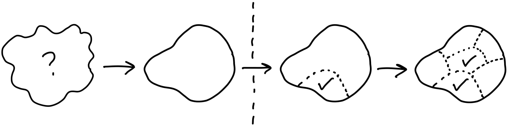

# Shape Up
**Pare de girar em círculos e envie trabalhos que importam** 
*por Ryan Singer*

---

### [Prefácio por Jason Fried](0.1-foreword.md)
### [Agradecimentos](0.2-acknowledgements.md)

*CAPÍTULO 1*
### [Introdução](0.3-chapter-01.md)
Crescimento doloroso
Ciclos de seis semanas
Formatando o trabalho
Tornando as equipes responsáveis
Alvejando riscos
Como este livro está organizado

## Parte 1: Formatando
*CAPÍTULO 2*
### [Princípios de Formatação](1.1-chapter-02.md)
Wireframes são muito concretos
Palavras são muito abstratas
Estudo de caso: O Calendário de Grade de Pontos
Propriedade 1: É áspero
Propriedade 2: Está resolvido
Propriedade 3: Está limitado
Quem formata
Dois caminhos
Passos para formatar

*CAPÍTULO 3*
### [Estabeleça Limites](1.2-chapter-03.md)
Definindo o apetite
Escopo variável, tempo fixo
"Boa" é relativo
Respondendo a ideias brutas
Reduzindo o problema
Estudo de caso: Definindo "calendário"
Cuidado com os sacos de surpresas
Limites estabelecidos

*CAPÍTULO 4*
### [Encontre os Elementos](1.3-chapter-04.md)
Mova-se na velocidade certa
Prototipagem rápida
Esboços com marcador grosso
Os elementos são o resultado
Espaço para designers
Ainda não entregável
Sem esteira transportadora

*CAPÍTULO 5*
### [Riscos e Buracos de Coelho](1.4-chapter-05.md)
Diferentes categorias de risco
Procure por buracos de coelho
Estudo de caso: Tapando um buraco
Declare fora dos limites
Corte de volta
Apresente a especialistas técnicos
Desrisque e pronto para ser documentado

*CAPÍTULO 6*
### [Escreva o Pitch](1.5-chapter-06.md)
Ingrediente 1: Problema
Ingrediente 2: Apetite
Ingrediente 3: Solução
Ajude-os a ver
Esboços incorporados
Esboços com marcador grosso anotados
Ingrediente 4: Buracos de Coelho
Ingrediente 5: Sem chances
Exemplos
Pronto para apresentar
Como fazemos isso no Basecamp

## Parte 2: Aposta
*CAPÍTULO 7*
### [Apostas, não Listas de Tarefas](2.1-chapter-07.md)
Sem listas de tarefas
Algumas apostas potenciais
Listas descentralizadas
Ideias importantes retornam

*CAPÍTULO 8*
### [A Mesa de Apostas](2.2-chapter-08.md)
Ciclos de seis semanas
Período de resfriamento
Tamanho da equipe e do projeto
A mesa de apostas
O significado de uma aposta
Tempo ininterrupto
O disjuntor
E quanto aos bugs?
Mantenha a lousa limpa

*CAPÍTULO 9*
### [Faça Suas Apostas](2.3-chapter-09.md)
Olhe onde você está
Produtos existentes
Novos produtos
Modo P&D
Modo de produção
Modo de limpeza
Exemplos
Perguntas a fazer
O problema importa?
O apetite está certo?
A solução é atraente?
Este é o momento certo?
As pessoas certas estão disponíveis?
Publique a mensagem de início

## Parte 3: Construindo
*CAPÍTULO 10*
### [Entregue a Responsabilidade](3.1-chapter-10.md)
Atribua projetos, não tarefas
Feito significa implantado
Se orientando
Tarefas imaginadas vs descobertas

*CAPÍTULO 11*
### [Conclua uma Peça](3.2-chapter-11.md)
Integre um pedaço
Estudo de caso: Clientes em projetos
Programadores não precisam esperar
Facilidades antes de telas perfeitas
Programa o suficiente para o próximo passo
Comece pelo meio

*CAPÍTULO 12*
### [Mapeie os Escopos](3.3-chapter-12.md)
Organize por estrutura, não por pessoa
O mapa de escopo
A linguagem do projeto
Estudo de caso: Rascunhos de mensagens
Descobrindo escopos
Como saber se os escopos estão corretos
Bolos camada
Icebergs
Ensopado
Marque agradáveis de ter com ~

*CAPÍTULO 13*
### [Mostre Progresso](3.4-chapter-13.md)
As tarefas que não estão lá
Estimativas não mostram incerteza
O trabalho é como uma colina
Escopos na colina
Status sem perguntar
Ninguém diz "Eu não sei"
Prompts para refatorar os escopos
Construa seu caminho morro acima
Resolva na sequência correta

*CAPÍTULO 14*
### [Decida Quando Parar](3.5-chapter-14.md)
Compare com a linha de base
Limites motivam trade-offs
O escopo cresce como grama
Cortar o escopo não é baixar a qualidade
Martelando o escopo
QA é para as bordas
Quando estender um projeto

*CAPÍTULO 15*
### [Sigam em Frente](3.6-chapter-15.md)
Deixe a tempestade passar
Permaneça sem dívidas
O feedback precisa ser formatado

### [Conclusão](3.7-conclusion.md)
Conceitos chave
Entre em contato

---

## Apêndices

### [Como Implementar o Shape Up no Basecamp](4.0-appendix-01.md)
Uma equipe do Basecamp para formatação
Projetos do Basecamp para projetos de ciclo
Listas de tarefas para escopos
Acompanhe os escopos no Gráfico da Colina

### [Ajuste ao Seu Tamanho](4.1-appendix-02.md)
Verdades básicas vs. práticas específicas
Pequeno o suficiente para improvisar
Grande o suficiente para se especializar

### [Como Começar a Formatar no Shape Up](4.2-appendix-03.md)
Opção A: Um experimento de seis semanas
Opção B: Comece com formatação
Opção C: Comece com ciclos
Corrigir o envio primeiro
Concentre-se no resultado final

### [Glossário](4.5-appendix-06.md)

### [Sobre o Autor](4.6-appendix-07.md)