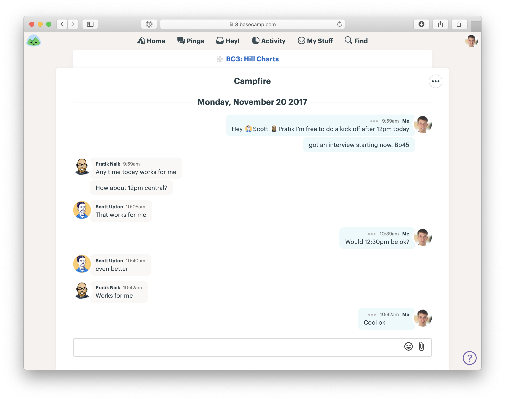

### Delegando Responsabilidades

Fizemos nossas apostas e agora é hora de iniciar o próximo ciclo. Como a equipe começa?

## Atribuir Projetos, não Tarefas

**Não** começamos atribuindo tarefas para ninguém. Ninguém desempenha o papel de "mestre de tarefas" ou "arquiteto" que divide o projeto em pedaços para outras pessoas executarem.

Dividir o projeto em tarefas desde o início é como passar o projeto por uma trituradora de papel. Todos acabam com peças desconectadas. Queremos que o projeto permaneça "inteiro" durante todo o processo para nunca perdermos de vista o panorama geral.

Em vez disso, confiamos na equipe para assumir o projeto como um todo e trabalhar dentro dos limites definidos. A equipe vai definir suas próprias tarefas e sua própria abordagem para o trabalho. Eles terão total autonomia e usarão seu julgamento para executar o projeto da melhor forma possível.

As equipes adoram ter mais liberdade para implementar uma ideia da maneira que acham melhor. Pessoas talentosas não gostam de ser tratadas como "macacos de código" ou meros executores de tarefas.

Os projetos também saem melhores quando a equipe tem a responsabilidade de cuidar de todo o projeto. Ninguém consegue prever no início de um projeto exatamente o que será necessário para que todas as peças se encaixem corretamente. O que funciona no papel quase nunca funciona exatamente como foi projetado na prática. Os designers e programadores que estão realmente fazendo o trabalho estão na melhor posição para fazer mudanças, ajustes ou identificar peças faltantes.

Quando as equipes recebem tarefas individuais, cada pessoa pode executar sua pequena parte sem se sentir responsável por avaliar como todas as peças se encaixam. Planejar no início faz com que você fique cego para a realidade ao longo do caminho.

Lembre-se: não estamos dando às equipes liberdade absoluta para inventar uma solução do zero. Já fizemos a formatação. Já estabelecemos os limites. Agora vamos confiar na equipe para preencher o esboço do projeto com decisões reais de design e implementação.

É aqui que nossos esforços para definir o projeto no nível correto de abstração — sem detalhes demais — vão valer a pena. Com seu talento e conhecimento dos detalhes específicos, a equipe vai chegar a um produto final melhor do que poderíamos tentando determinar a forma final antecipadamente.

## Concluído significa implantado

No final do ciclo, a equipe vai implantar seu trabalho. No caso de uma equipe de "Lote Pequeno" com alguns projetos pequenos para o ciclo, eles vão implantar cada um conforme acharem adequado, desde que aconteça antes do final do ciclo.

Essa restrição nos mantém fiéis às nossas apostas e respeita o `interruptor de circuito`. O projeto precisa ser concluído dentro do tempo que orçamos; caso contrário, nosso apetite e orçamento não significam nada.

Isso também significa que qualquer teste e garantia de qualidade precisam acontecer *dentro* do ciclo. A equipe vai planejar isso, focando nos aspectos mais essenciais do projeto, concluindo-os cedo e coordenando com a garantia de qualidade. (Mais sobre isso depois.)

Para a maioria dos projetos, não somos rígidos quanto ao timing de documentação de ajuda, atualizações de marketing ou anúncios aos clientes e não esperamos que esses eventos ocorram dentro do ciclo. Eles têm um risco baixo (nunca levam 5x mais tempo do que pensamos que vão levar) e são em sua maioria tratados por outras equipes. Costumamos cuidar dessas atualizações e publicar um anúncio sobre o novo recurso durante o período de resfriamento após o ciclo.

## Início

Começamos o projeto criando um novo projeto no [Basecamp](https://basecamp.com/) e adicionando a equipe a ele. Então, a primeira coisa que faremos é publicar o conceito delineado no Quadro de Mensagens. Vamos postar o pitch original ou uma versão resumida dele.

A primeira coisa no projeto do [Basecamp](https://basecamp.com/) é uma mensagem com o conceito delineado.

Como nossas equipes são remotas, usamos o chat do Basecamp no projeto para agendar uma chamada de início.

Agendando uma chamada com a equipe para revisar o trabalho delineado.

A chamada oferece à equipe a chance de fazer qualquer pergunta importante que não tenha ficado clara na descrição. Então, com um entendimento inicial do projeto, eles estão prontos para começar.

## Orientação Inicial

Nos primeiros dias, o trabalho não parece "trabalho". Ninguém está marcando tarefas. Nada está sendo implantado. Não há entregas para avaliar. Muitas vezes, nem há muita comunicação entre a equipe nos primeiros dias. Pode haver um tipo estranho de silêncio radiofônico.

Por quê? Porque cada pessoa está focada tentando entender como o sistema existente funciona e qual é o melhor ponto de partida. Todos estão ocupados aprendendo o terreno e se orientando.

A equipe decidindo por onde começar.

É importante que os gestores respeitem esta fase. As equipes não podem simplesmente mergulhar em uma base de código e começar a construir novas funcionalidades imediatamente. Elas precisam se familiarizar com o código relevante, pensar no conceito e explorar alguns caminhos sem saída para encontrar um ponto de partida. Interferir ou pedir um status muito cedo prejudica o projeto. Isso retira o tempo necessário para que a equipe encontre a melhor abordagem. A exploração precisa acontecer de qualquer forma. Pedir por progresso visível só vai empurrar isso para debaixo do tapete. É melhor capacitar a equipe para dizer explicitamente "Ainda estou tentando descobrir como começar", para que não precisem esconder ou disfarçar este trabalho legítimo.

Em geral, se o silêncio não começar a se dissipar após três dias, é um momento razoável para intervir e ver o que está acontecendo.

## Tarefas Imaginadas vs Descobertas

Como a equipe recebeu o projeto e não tarefas, eles precisam criar as tarefas por conta própria. Aqui observamos uma diferença importante entre as tarefas que *achamos* que precisamos fazer no início de um projeto e as tarefas que *descobrimos* que precisamos fazer no curso do trabalho real.

A equipe naturalmente começa com algumas tarefas imaginadas — aquelas que eles supõem que terão que fazer só de pensar no problema. Então, à medida que colocam a mão na massa, descobrem todo tipo de coisas que não sabiam antecipadamente. Esses detalhes inesperados constituem a maior parte do projeto e às vezes apresentam os desafios mais difíceis.

As equipes descobrem as tarefas fazendo trabalho real. Por exemplo, o designer adiciona um novo botão na interface desktop, mas então percebe que não há um lugar óbvio para ele na versão mobile. Eles registram uma nova tarefa: descobrir como revelar o botão no mobile. Ou a primeira versão do design tem uma boa hierarquia visual, mas depois o designer percebe que precisa haver mais texto explicativo em um lugar que perturba o layout. Duas novas tarefas: alterar o layout para acomodar o texto explicativo; escrever o texto explicativo.

Muitas vezes, uma tarefa aparece no processo de fazer algo não relacionado. Suponha que um programador esteja trabalhando em uma migração de banco de dados. Enquanto olha o modelo para entender as associações, ela pode encontrar um método que precisa ser atualizado para uma parte diferente do projeto mais tarde. Ela vai querer anotar uma tarefa para atualizar esse método depois.

**A maneira real de descobrir o que precisa ser feito é começar a fazer trabalho real.** Isso não significa que as equipes começam construindo qualquer coisa. Elas precisam escolher algo significativo para construir primeiro. Algo que seja central para o projeto, mas ainda pequeno o suficiente para ser concluído de ponta a ponta — com UI funcionando e código funcionando — em poucos dias.

Nos próximos capítulos, veremos como a equipe escolhe esse alvo e trabalha em conjunto para obter um spike totalmente integrado funcionando.
