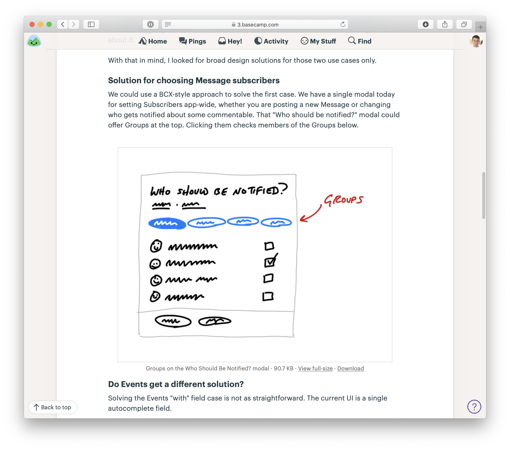
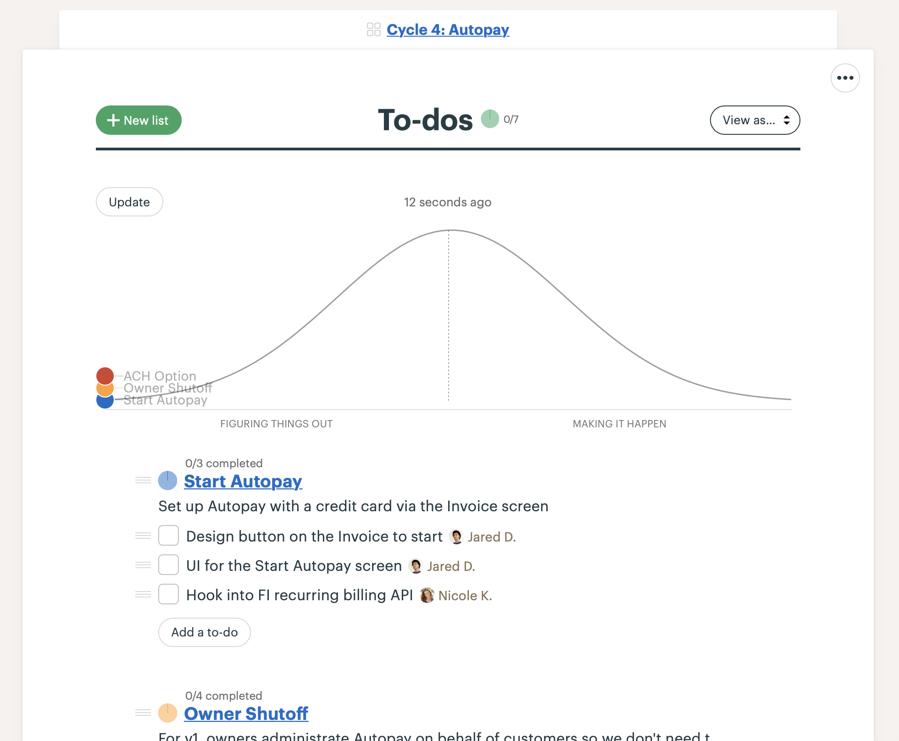

# Como Implementar o Shape Up no Basecamp

Construímos o [Basecamp](https://basecamp.com/) para implementar o método Shape Up. Em vez de dispersar nosso trabalho por várias ferramentas, o Basecamp centraliza toda a comunicação do projeto, gerenciamento de tarefas e documentação em um só lugar. Veja como usamos:

## Uma Equipe Basecamp para moldar

1. Crie uma Equipe Basecamp para moldar. Chamamos a nossa de "Estratégia de Produto".
2. Adicione as pessoas responsáveis pela moldagem, quaisquer pessoas de confiança que dão feedback sobre os pitches e as pessoas que apostam na mesa de apostas. Mantenha este grupo pequeno e anuncie as apostas mais amplamente em outro lugar (usamos o HQ do Basecamp para isso), na hora de iniciar um ciclo.
3. Publique os pitches como Mensagens no Quadro de Mensagens. Criamos uma Categoria de Mensagem chamada "Pitch" com o emoji de lâmpada para o ícone.
4. Use a sala de chat Campfire para discutir ideias e coordenar a mesa de apostas entre os ciclos. Realizamos a reunião da mesa de apostas por vídeo.

Pitches no Quadro de Mensagens da equipe de Estratégia de Produto no Basecamp

Um esboço desenhado em um iPad no meio de um pitch

Jason anuncia as apostas para o próximo ciclo no HQ — uma equipe no Basecamp que inclui toda a empresa

## Projetos Basecamp para os projetos do ciclo

1. Crie um Projeto Basecamp para cada projeto no ciclo de seis semanas. Normalmente, prefixamos um nome ou número para o ciclo assim: "Ciclo 4: Autopagamento."
2. Adicione o designer e programadores que estão trabalhando neste projeto ao Projeto Basecamp.
3. Publique uma mensagem de início no Quadro de Mensagens com o pitch ou uma reafirmação do trabalho moldado para referência da equipe.

Criando o projeto

Adicionando o designer e programador

A primeira coisa no projeto é uma mensagem de início com o conceito moldado

A equipe usa a sala de chat no projeto Basecamp para se comunicar enquanto começam

## Listas de Tarefas para escopos

1. Após a equipe se orientar, eles começam a explorar, descobrir tarefas e [mapeá-las em escopos](https://basecamp.com/shapeup/3.3-chapter-12).
2. No Projeto Basecamp, a equipe cria uma Lista de Tarefas para cada escopo, como "Iniciar Autopagamento" ou "Opção de ACH". Às vezes, usamos o campo de descrição na Lista de Tarefas para resumir o escopo.
3. Adicione tarefas de design e programação a cada escopo como Itens de Tarefa. Por exemplo, "Iniciar Autopagamento" tem uma tarefa para projetar a interface do usuário e outra para conectá-la à API existente de cobrança recorrente. Eles podem usar o thread de discussão em cada Item de Tarefa para postar atualizações ou fazer perguntas uns aos outros.
4. Repita conforme a equipe descobre novos escopos e tarefas.

Listas de Tarefas para cada escopo com tarefas de designer e programador embaixo. Observação: essas são apenas as tarefas descobertas até agora.

## Acompanhar escopos no Gráfico de Hill

1. Navegue até a página da Lista de Tarefas de cada escopo e clique no menu de opções (•••) no canto superior direito. Clique em "Acompanhar isso no Gráfico de Hill". Isso exibirá um Gráfico de Hill na parte superior da seção geral de Tarefas do Projeto, com um ponto correspondente a esse escopo (Lista de Tarefas).
2. Repita para cada escopo (Lista de Tarefas).
3. Clique em "Atualizar" no Gráfico de Hill e arraste os pontos para mostrar o progresso de "desconhecido" para "conhecido" até "feito". Use o recurso de anotação para adicionar comentários quando necessário.
4. Para ver o histórico de atualizações do Gráfico de Hill, clique no carimbo de data e hora acima do Gráfico de Hill onde está escrito "última atualização".

Acompanhando um escopo (Lista de Tarefas) no Gráfico de Hill via o menu de opções na página da Lista de Tarefas

Depois de habilitar o Gráfico de Hill em cada Lista de Tarefas, um ponto aparece para cada escopo

Arraste os pontos para atualizar o Gráfico de Hill

O Gráfico de Hill atualizado aparece no topo da página de Tarefas

Clicando no carimbo de data e hora no topo do Gráfico de Hill, você vê um histórico de atualizações. A mais recente fica no topo.